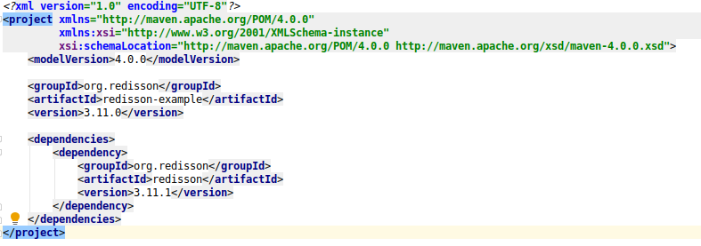
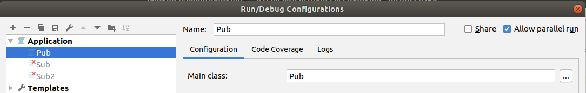
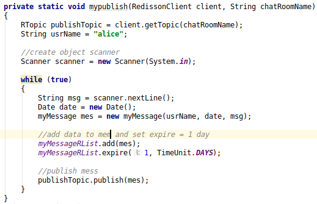
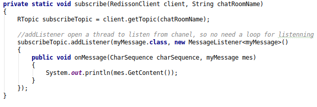
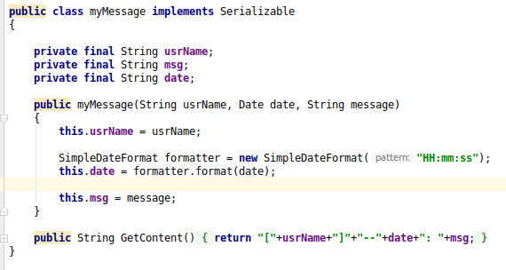

# Ứng dụng chat

## Yêu cầu bài toán

Viết ứng dụng chat đơn giản sử dụng Redis Pub/Sub, java, maven và thư viện redisson.

## Thư viện redisson

Redisson là Redis client cho Java với các tính năng In-Memory Data Grid.

Import thư viện redisson vào Maven: thêm dependency trong tab dependencies của file pom.xml:

## Ý tưởng bài toán

- B1: Kết nối đến redis server qua port 6379
- B2: Cho phép người dùng nhập tên chanel và tiến hành đọc dữ liệu chat cũ của chanel.
- B3: Mở thread sub lắng nghe message trên chanel.
- B4: Mở vòng lặp publish message lên chanel và lưu dữ liệu gồm [tên user]--[giờ]: [mes]

## Áp dụng

- Cài đặt redis: https://redis.io/download.
- Cài đặt java trên ubuntu 18.04: https://linuxize.com/post/install-java-on-ubuntu-18-04/
- Cài đặt inteliji: https://linuxize.com/post/how-to-install-intellij-idea-on-ubuntu-18-04/
- Allow paralell run:
- 
- Hàm publish:
- 
- Hàm subscribe:
- 
- Định nghĩa kiểu dữ liệu cho mess:
- 

## Chạy

Lưu ý trước khi chạy, gọi lệnh redis-server trên terminator để mở server cho kết nối.

Chọn Run 'Pub' hoặc nhấn Shift + F10 để chạy, có thể chạy song song để tạo nhiều client hơn.

## Tham khảo

[Redis-redisson](https://github.com/redisson/redisson)

[Redisson guide and sample](https://www.baeldung.com/redis-redisson)
